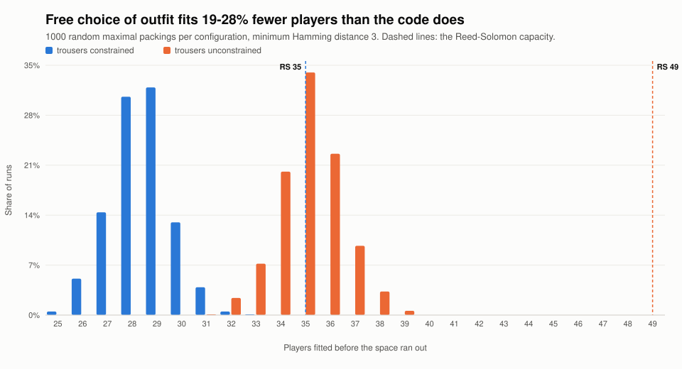

# Plan: Team-photo player identification via colour codes

> **Status:** design / hand-off document. This is the complete brief for a fresh
> implementation session. It captures *every* decision made so far and the
> reasoning behind it, so the implementer does not need to re-derive anything.
> Nothing in here has been implemented yet.
>
> **Branch:** `claude/haiku-color-recognition-test-n28fld`
>
> **Revision note:** §0–§3, §9 and §11 were revised after empirical vision testing
> and a fresh coding-theory pass (see §12 for the measurements that drove it).
> The configuration is now **4 channels × 7 colours**, not the 3 × 5 originally
> drafted. The architecture in §4–§8 is unchanged — it was designed to be
> reconfigurable and the new config is a `config.py` edit.

---

## 0. TL;DR for the implementer

Build a **self-contained, independently unit-tested Python module** that maps the
colours a player wears (read from a "shot" photo) to *which player it is*, robustly
against a hidden item or a misread colour.

- Players wear colours across **channels** (wearable slots). **4 channels:
  t-shirt, trousers, hat, armbands.**
- Each channel uses a palette of **7 colours**. The code is the MDS
  Reed–Solomon `[4,2,3]` over `GF(7)`, giving **49 distinct player identities**
  at minimum distance **d = 3**.
- The **trousers** channel used to deliberately use **fewer than 7 colours**
  from a set of its own (see §2.6), because guests supply their own clothing and
  purple/orange trousers are hard to come by. Capacity is
  `7 × (number of trouser colours)`, and 5 colours only bought 35 — fewer than
  the guest list — so that channel now wears the same 7-colour palette as the
  rest, giving the full 49.
- The number of colours, the number of channels, *and* the kind of channel
  (a channel could be shapes instead of colours) must **all be reconfigurable
  without touching the decode logic.** This extensibility is the single most
  important non-functional requirement.
- The actual matching/decoding code must live in its **own module with its own
  unit tests**, decoupled from the database, the web layer, and the vision/LLM
  call.

The guarantee at `d = 3` is: **correct up to two erasures (hidden garments), OR
correct one misread, OR correct one erasure and detect one misread.** Equivalently
and more usefully: **any two correctly-read garments uniquely identify the player**
— it does not matter which two.

---

## 1. Background: how the game works today

Streetfight is a real-world team game. Players "shoot" opponents by taking a
photo. The relevant existing flow:

- `User.submit_shot(image_base64)` (`backend/user_interface.py:249`) stores a
  `Shot` row containing:
  - `image_base64` — the photo,
  - `location_context` — a JSON snapshot of **all users' GPS locations at the
    moment the shot was fired** (`AdminInterface.get_locations(game_id)`),
  - the shooter (`user`/`team`), `shot_damage`, etc.
- An admin later reviews unchecked shots (`AdminInterface.get_unchecked_shots`,
  `backend/admin_interface.py:237`) and **manually** decides who was hit, calling
  `AdminInterface.hit_user(shot_id, target_user_id)` (`backend/admin_interface.py:319`),
  which applies damage and marks the shot checked.
- `Team` has a `name` only (e.g. "Red Team"); sample teams are seeded in
  `backend/reset_db.py` (`TEAM_COLOURS`). **There is no per-player colour data and
  no AI categorisation today.** Both are introduced by this work.

**Where this feature plugs in:** an AI step reads the target's worn colours from
the shot photo, the new module decodes those colours (plus the GPS prior) into a
**ranked list of candidate target players**, and the admin review UI surfaces the
top candidate for one-click confirmation (still calling the existing
`hit_user`). Human-in-the-loop is retained initially (see §2.4 / §8).

### Tech facts that constrain the design
- Backend is FastAPI + SQLAlchemy (`backend/model.py`), Python 3, Pillow.
- **No numpy / scipy / galois libraries are available** (see `flake.nix`
  `pythonReqs`). Keep the core module **pure-Python and dependency-free.**
  Field arithmetic mod a small prime is a few lines.
- Tests use `pytest` (config in `setup.cfg`, `tests/` directory, flat
  `test_*.py` files, fixtures in `tests/shared_fixtures.py`).

---

## 2. The identification concept and the coding-theory decisions

### 2.1 Channels, colours, codewords
- A **channel** is one categorical feature of a player's appearance that the
  vision model can read independently: shirt colour, head colour, armband colour
  (and, in future, left-arm vs right-arm separately, or a *shape* printed on the
  shirt).
- Each channel has an **alphabet** of distinguishable symbols. For colour
  channels the alphabet is the colour palette; for a shape channel it would be a
  set of shapes. **Channels may have different alphabets, but for the algebraic
  code they must share a common cardinality `q`** (see §4 — physical symbols are
  mapped onto `GF(q)` indices).
- A player's identity is a **codeword**: one symbol per channel,
  e.g. `(shirt=red, head=green, armband=blue)`.

### 2.2 The two fault types
- **Erasure** — a channel is hidden/occluded, so the vision model returns
  "unknown" for it. We *know which* channel failed.
- **Misread** — the vision model returns the *wrong* symbol for a channel and we
  don't know it's wrong.

### 2.3 The coding-theory facts (so nobody re-derives them)
- A code with minimum Hamming distance `d` can simultaneously correct `t`
  misreads and `e` erasures **iff `d ≥ 2t + e + 1`**.
- Hamming distance can never exceed the number of channels `n` (`d ≤ n`).
- Singleton bound: number of codewords `≤ q^(n − d + 1)`. MDS codes (parity,
  Reed–Solomon) meet it with equality.

### 2.4 The decision: 4 channels × 7 colours, `[4,2,3]` RS over `GF(7)`

The driving constraint is that **photographs are taken of players actively
running away and trying not to be photographed.** Occlusion is the normal case,
not the exception, so erasure tolerance matters far more than raw capacity.

Because 49 identities is comfortably more than the expected guest count, we only
need `k = 2` information symbols (`7² = 49`). That makes **`d = n − k + 1 = n − 1`**:
every channel added buys one more tolerated erasure, for free.

| Channels | Identities | `d` | Erasures tolerated | Channels needed to ID |
|---|---|---|---|---|
| 3 | 49 | 2 | 1 | any 2 |
| **4 (chosen)** | **49** | **3** | **2** | **any 2** |
| 5 | 49 | 4 | 3 | any 2 |

**The channels are: t-shirt, trousers, hat, armbands.** These were chosen because
they are observable from *any* angle, which armbands alone are not.

**The armbands are one symbol worn on both arms**, not two independent channels.
This is deliberate: duplicating the symbol attacks the *erasure probability*
(roughly 55% → 80% visible, since the two arms fail independently) rather than the
code distance. Splitting them into two distinct channels was simulated and gains
only ~1 percentage point of correct identification while requiring every guest to
source two armband colours — see §12.3.

Guarantees at `d = 3`, from `d ≥ 2t + e + 1`:

- **Up to 2 erasures → corrected.** Any two hidden garments are fine.
- **1 misread, nothing hidden → corrected.**
- **1 erasure + 1 misread → detected** (flagged, not silently mis-identified).
- **Any two correctly-read channels uniquely identify the player.** Verified
  exhaustively: all six channel pairs yield 49 distinct pairs.

**Anti-cheat bonus:** because the nearest other codeword is 3 symbols away, a
player must change **at least three of their four garments** to impersonate
someone else. Changing one garment still decodes to their own identity.

### 2.5 The upgrade ladder (must be a drop-in, not a rewrite)
The module must make each of these a config change only:

| Config | Code | Guarantee | Capacity |
|---|---|---|---|
| 3 channels × 7 colours | `[3,2,2]` parity | correct 1 erasure **or** detect 1 misread | 49 |
| **4 channels × 7 colours (chosen)** | `[4,2,3]` RS | correct 2 erasures; or 1 misread; or 1 erasure + detect 1 misread | **49** |
| 5 channels × 7 colours | `[5,2,4]` RS | correct 3 erasures; or 1 erasure + 1 misread together | 49 |
| 4 channels × 7 colours, `k=3` | `[4,3,2]` parity | correct 1 erasure **or** detect 1 misread | 343 |

Capacity for an `[n, k]` code is `q^k`; distance is `n − k + 1` for MDS codes.
Trading `k` up buys capacity and costs distance. **We are capacity-rich and
erasure-poor, so keep `k = 2`.**

### 2.6 Restricting the trousers alphabet (per-channel palettes)

> **Superseded in part, and worth reading anyway.** The trousers channel no
> longer has a palette of its own: the guest list outgrew the 35 identities a
> five-colour channel allows, and widening it is the remedy this section and
> §11.1 both name. Rather than top the restricted set back up to seven, it now
> shares the main palette — which also drops white, the one colour §9.1 excluded
> on *measurement* rather than on sourcing (see §9.1).
>
> What survives is everything below about *how* a narrowed channel works — the
> mechanism is still in `ChannelSet.is_representable`, `CHANNEL_PALETTES` is
> still the place to declare one, and putting a channel back on its own alphabet
> is one line of `config.py`.

Guests supply their own clothing, so the channels are **not equally capable**.
Yellow, purple and orange trousers are rare in ordinary wardrobes; t-shirts and
hats come in anything.

Two facts make this cheap to accommodate:

1. **Capacity with a restricted channel is `q × s`**, where `s` is the size of the
   smallest channel alphabet. (Delete the `d − 1 = 2` least-visible positions; the
   remaining two must still separate everyone, and the tightest such pair includes
   trousers.) So `s = 5 → 35 identities`, `s = 4 → 28`.
2. **A channel's physical colours need not be a subset of any other channel's.**
   The code operates on `GF(7)` indices; only the *cardinality* matters. And a
   misread can only ever confuse two colours **within the same channel**, so
   green trousers never need to be told apart from yellow trousers if yellow is
   not in the trousers vocabulary at all.

Therefore the trousers channel used **five easy-to-source colours that are not
all drawn from the main palette** (§9.1). Restricting trousers cost essentially
nothing in accuracy and slightly *reduced* the misread rate, because fewer
symbols in a channel means fewer ways to get it wrong (§12.3) — and lifting the
restriction gives that small margin up again, which is the price of the extra 14
identities.

The sourcing argument is also weaker than it looks now that players **pick**
their outfit from the colours they say they own (§12.6, roadmap #10) rather than
being handed one. A colour hardly anyone owns is not a colour anyone is forced
into: it is offered to the few who do own it, and ranked *first* for them,
because rare clothing is what the identification wants (`COLOUR_COMMONNESS`).
What the restriction really bought, and what lifting it costs, is **wardrobe
coverage**: white/cream chinos are no longer expressible, so the two garments a
player sources themselves come in four widely-owned shades rather than five.

> **Do not** "solve" the trousers problem by adding a fifth channel (e.g. socks)
> so trousers can drop to 2 colours. That was simulated: it forces `k = 3`, which
> means **three** visible garments are needed instead of two, and costs ~9
> percentage points of correct identification. See §12.3.

---

## 3. Configuration decisions to bake in (but keep changeable)

| Decision | Value | Must be configurable? |
|---|---|---|
| Channels | `tshirt`, `trousers`, `hat`, `armbands` (4) | **Yes** — add/remove/reorder channels |
| `q` (field size / max alphabet) | 7 | **Yes** — must stay prime (see below) |
| Full palette (t-shirt, hat, armbands) | 7 colours, §9.1 | **Yes** |
| Trousers palette | none of its own — the main palette (a 5-colour set of its own, §9.1, until the guest list outgrew it) | **Yes** — `s` is a free parameter |
| Code | `[4,2,3]` Reed–Solomon over GF(7) | **Yes** — swap per §2.5 |
| Player capacity | `q × s` = 49 (35 while trousers were restricted to 5) | derived |
| Guarantee | correct 2 erasures / 1 misread / 1 erasure + detect 1 misread | derived from `d = 3` |

> **Prime-field constraint (document it):** the algebraic code uses `GF(q)`
> arithmetic. The simple, dependency-free implementation supports `q` =
> **prime** (5, 7, 11, …). 7 is prime, so the chosen config is fine. Non-prime
> prime powers (e.g. 4, 8, 9) would need `GF(p^m)` arithmetic — out of scope;
> if you need exactly those counts, either round up to the next prime number of
> colours or implement extension-field arithmetic later.

> **Restricted-alphabet channels:** a channel may legitimately expose **fewer
> than `q` labels**. The scheme must then only assign codewords whose symbol in
> that channel falls inside the allowed subset — capacity becomes `q^(k−1) × s`
> (`7 × 5 = 35` while the trousers channel carried five colours). Distance is
> unaffected: a subset of a code has minimum
> distance at least that of the parent. This must be a first-class feature, not a
> hack, since it is how the trousers channel works.

---

## 4. Architecture — the new pure module (the centrepiece)

Create a package `backend/identity/` containing **only pure logic**: no
SQLAlchemy, no FastAPI, no Pillow, no network. This is what gets independently
unit-tested. Layering (each layer depends only on the ones above it):

```
backend/identity/
  galois.py     # GF(p) prime-field arithmetic (add/sub/mul/inv mod p)
  code.py       # LinearCode: codewords, min distance, encode; factory for parity / MDS
  channels.py   # Channel (name + ordered physical labels) and ChannelSet; label<->index maps
  scheme.py     # IdentityScheme: binds a ChannelSet + a LinearCode + player<->codeword assignment
  observations.py # data types for a per-channel reading (distribution or erasure) + priors
  decoder.py    # soft decoder: observations + prior -> ranked posteriors + ambiguity/inconsistency flag
  config.py     # the initial, declarative config (3 channels, 5 colours, parity) and a factory
```

The crucial abstraction boundary: **the decoder and the scheme depend only on
the abstract `LinearCode` interface (a set of codewords over `GF(q)`) and the
abstract `ChannelSet`.** Swapping the parity code for RS, adding a channel, or
growing `q` constructs a *different* `LinearCode`/`ChannelSet` — the decoder and
all integration code are untouched. That is the extensibility guarantee.

---

## 5. Component specifications

### 5.1 `galois.py`
- Minimal prime-field arithmetic: `add`, `sub`, `mul`, `inv`, `neg` mod a prime
  `p`, validated `p` is prime. Inverse via Fermat (`a^(p−2)`) or extended
  Euclid. ~30 lines, no deps.
- This is all the algebra the parity *and* MDS codes need.

### 5.2 `code.py` — `LinearCode`
- Represents a code over `GF(q)` of length `n`. Public surface:
  - `n`, `q`, `k` (message length), `capacity = q**k`,
  - `codewords()` → iterable of `n`-tuples of ints in `[0, q)`,
  - `min_distance()` → int (compute by brute force over codeword pairs; fine for
    these tiny codes, and lets tests assert the theoretical `d`),
  - `encode(message)` → codeword (message is a `k`-tuple over `GF(q)`),
  - optionally `is_codeword(word)` and `syndrome(word)`.
- **Factory functions:**
  - `parity_code(n, q)` → `[n, n−1, 2]` code: valid iff `sum(symbols) % q == 0`.
    This is the initial code (`parity_code(3, 5)`).
  - `reed_solomon_code(n, k, q)` → `[n, k, n−k+1]` MDS code (evaluation of degree
    `<k` polynomials at `n` distinct points of `GF(q)`; requires `n ≤ q`). Used
    for the `[4,2,3]` and `[5,2,4]` upgrades.
  - A small `build_code(n, q, target_distance)` convenience that returns a parity
    code when `target_distance == 2`, else an RS code, and **raises a clear error
    if the request is infeasible** (e.g. `d=4` at `n=3`, or RS with `n > q`).
- Brute-force `min_distance` doubles as the test oracle (assert `[3,2,2]`→2,
  `[4,2,3]`→3, `[5,2,4]`→4).

### 5.3 `channels.py`
- `Channel`: `name` (e.g. `"tshirt"`) + `labels` (ordered list of physical symbol
  names, e.g. `["black","purple","red","blue","green","orange","yellow"]`).
  Provides `label_to_index` / `index_to_label`. Different channels may have
  **different** label lists (different colours entirely, or colours vs shapes).
- **A channel may expose fewer than `q` labels** (the trousers case, §2.6). The
  channel therefore also reports its `allowed_symbols()` — the set of `GF(q)`
  indices it can physically represent, `{0 … len(labels)−1}`. The scheme uses this
  to filter the codeword set (§5.4). A channel with `len(labels) > q` is an error;
  fewer is legitimate and expected.
- `ChannelSet`: ordered list of `Channel`s; length must equal the code's `n`.
  Converts a codeword (tuple of `GF(q)` indices) ↔ a dict of
  `{channel_name: label}` ("what the player physically wears").

### 5.4 `scheme.py` — `IdentityScheme`
- Binds a `ChannelSet` + a `LinearCode` + an **assignment** of player IDs to
  codewords. Public surface:
  - `usable_codewords()` → the codewords of the `LinearCode` **filtered** so that
    every symbol lies within its channel's `allowed_symbols()`. This is what makes
    the restricted trousers alphabet work; `capacity` is the size of *this* set
    (49 for the current config, where every channel is full width; 35 while
    trousers carried five colours), not `q^k` in general.
  - `assign(player_ids)` → deterministic mapping `player_id → codeword`
    (raise if more players than `capacity`),
  - `appearance(player_id)` → `{channel_name: label}` (what to tell a player to
    wear / what to print on a costume sheet),
  - `codeword_of(player_id)` and reverse `player_of(codeword)`,
  - hands the codeword set + channel metadata to the decoder.
- **Assignment policy:** store a stable integer "slot" (`0 .. capacity-1`) per
  player and derive the codeword via `encode(slot_as_message)`. Storing the slot
  (not the raw colours) means re-deriving colours if the scheme parameters
  change — but note (see §8) that changing `q`/channels mid-game changes what
  everyone wears, so treat scheme parameters as fixed per game.

### 5.5 `observations.py`
- `ChannelObservation`: per channel, either
  - a **distribution** `{label_or_index: probability}` over that channel's
    alphabet (preferred — this is what a good vision model can emit), or
  - a single best `symbol` + `confidence` (convenience; expand internally to a
    distribution: `confidence` on the symbol, the rest spread over the others), or
  - **erasure** (`None`) — channel unreadable.
- `Reading`: an ordered set of `ChannelObservation`s (one per channel).
- `Prior`: `{player_id: probability}` (from GPS, §8) — optional; defaults to
  uniform over the candidate set.

### 5.6 `decoder.py` — the soft decoder (the heart)
- `decode(reading, candidates, prior=None)` →
  `DecodeResult(ranked=[(player_id, posterior), ...], flags=...)`.
- **Likelihood model.** For a candidate player with codeword `c`:
  `likelihood(c) = ∏_channels L_i`, where for channel `i`:
  - erased → `L_i = 1` (contributes no information),
  - observed as distribution `O_i` → `L_i = O_i[c_i]` (probability the vision
    model assigned to the *true* symbol; use a small floor `ε` to avoid zeros),
  - observed as `(symbol s, confidence p)` → `L_i = p` if `c_i == s` else
    `(1 − p)/(q − 1)`.
- **Posterior:** `posterior(player) ∝ prior(player) · likelihood(codeword)`,
  normalised over candidates.
- **Flags / graceful generalisation of the hard guarantees:**
  - `inconsistent` — no codeword matches a clean (no-erasure) reading well
    (this is "detect a misread"),
  - `ambiguous` — top-2 posteriors within a margin (tie),
  - `confident` — top posterior above a threshold.
  These thresholds are config; the admin UI uses them to decide auto-suggest vs
  flag-for-review.
- The decoder is **completely independent of the vision/LLM and the DB** — tests
  feed `Reading`s and priors directly.

### 5.7 `config.py`
- Declarative config + a `default_scheme()` factory:
  - `q = 7`,
  - `MAIN_PALETTE = ["black","purple","red","blue","green","orange","yellow"]`,
  - no trousers palette any more: `CHANNEL_PALETTES = {}`, so every channel
    wears the main one. It was `["black","blue","green","red","white"]` (5 —
    deliberately a different physical set, see §9.1) until §2.6's restriction
    was lifted,
  - channels = `tshirt`, `trousers`, `hat`, `armbands` **in that order** (the order
    fixes the RS evaluation points and therefore the codeword layout — changing it
    changes what everyone wears),
  - code = `reed_solomon_code(4, 2, 7)`,
  - thresholds for the decoder flags.
- Changing the setup = editing this one file (add a colour to a palette; add a
  `Channel`; switch the code constructor).

---

## 6. Worked extensibility scenarios (prove each is a small change)

The implementer should keep these in mind and ideally cover them with
parametrised tests:

1. **Widen or narrow the trousers alphabet.** Add/remove labels on the trousers
   `Channel` only. Capacity moves as `7 × s` (28 at `s=4`, 35 at `s=5`, 49 at
   `s=7`). Nothing else changes — this is the routine knob, exercised whenever the
   guest list grows or someone can't find red trousers. It has since been turned
   in anger: the guest list passed 35 and `s` went from 5 back to 7, one line of
   `config.py`.
2. **Split armbands into left + right (5 channels).** Add a `Channel`; change the
   code to `reed_solomon_code(5, 2, 7)` (`[5,2,4]`, tolerates 3 erasures). Only
   `config.py` changes. **Note §12.3: this was measured and is not worth it** —
   keep it as a documented option, not the default.
3. **Add a "shape" channel.** New `Channel(name="shape",
   labels=["circle","square","triangle","star","cross"])` — a *different*
   alphabet of the same cardinality `q=5`. The vision adapter must learn to read
   shapes for that channel, but the code/scheme/decoder are unchanged because
   they operate on `GF(q)` indices, not on the physical meaning.
4. **Upgrade the guarantee without changing colours/channels count?** Not
   possible at fixed `n` (it's the `d ≤ n` ceiling). Document that the only way to
   buy more fault tolerance is more channels — this is a property of the math,
   surfaced clearly so future-you doesn't fight it.

---

## 7. Testing plan (the explicit "independently unit tested module" requirement)

Tests live in `tests/` (flat `test_identity_*.py`, matching repo convention),
import **only** from `backend.identity`, and use **no DB, no network, no
Pillow** — so the module is provably standalone. Suggested files/cases:

- `test_identity_galois.py` — field axioms: `a + (-a) == 0`, `a * inv(a) == 1`
  for all non-zero `a` in GF(7) (and GF(5)); rejects composite `p`.
- `test_identity_code.py`
  - `reed_solomon_code(4,2,7)`: 49 codewords, `min_distance == 3`.
  - **Assert the closed form of §11** holds for all 49 codewords:
    `hat == (2·trousers − tshirt) mod 7` and
    `armbands == (3·trousers − 2·tshirt) mod 7`.
  - **Assert the MDS property directly:** for every one of the six channel pairs,
    the 49 codewords project to 49 *distinct* pairs. This is the "any two garments
    identify you" guarantee and is the single most important invariant.
  - `parity_code(3,7)` → `d == 2`; `reed_solomon_code(5,2,7)` → `d == 4`.
  - `reed_solomon_code(9,2,7)` raises a clear infeasibility error (`n > q+1`).
- `test_identity_channels.py` — label↔index round-trips; **accepts a channel with
  fewer than `q` labels** and reports the right `allowed_symbols()`; rejects more
  than `q`; supports heterogeneous alphabets (trousers vs t-shirt vs a shape
  channel).
- `test_identity_scheme.py`
  - assignment is unique and deterministic; `appearance` ↔ `codeword` consistency.
  - **restricted-alphabet capacity:** with the 5-colour trousers channel,
    `capacity == 35`; with a 4-colour one, `28`; with 7, `49`.
  - every assigned codeword's trousers symbol is inside the allowed subset.
  - raises when players > capacity.
- `test_identity_decoder.py` — the behavioural core, parametrised over configs:
  - clean reading → correct player, posterior ≈ 1.
  - **any two channels erased** → still the correct player (the headline
    guarantee; parametrise over all six surviving pairs).
  - **single misread, nothing erased** → *corrected* to the right player.
  - **1 erasure + 1 misread** → flagged `inconsistent`/`ambiguous`, **never a
    confident wrong answer.** This is the boundary of the guarantee and must not
    regress silently.
  - 3 erasures → `ambiguous` (insufficient information), not a silent guess.
  - prior alone breaks a tie when the reading is ambiguous.
  - **Re-run the whole behavioural suite under the `[3,2,2]` and `[5,2,4]`
    configs** to prove the decoder is config-agnostic in both directions.

---

## 8. Integration plan (separate from the pure module)

Keep all of the following **outside** `backend/identity/` so the module stays
pure. These are follow-on tasks; the pure module + its tests are the priority
deliverable.

### 8.1 Vision adapter (the only externally-dependent piece)
- New module e.g. `backend/identity_vision.py` (note: depends on the Anthropic
  API + Pillow; **not** part of the pure package). Responsibility: given a shot
  image, return a `Reading` (per-channel symbol distributions or erasures).
- Implement behind an interface so the decoder/tests never need it. Provide a
  fake/stub implementation for local dev and tests.
- Prompt design: ask a current **vision-capable Claude model** to report, for
  each named channel (t-shirt, trousers, hat, armbands), the palette colour it
  sees *or* `"unknown"`, plus a confidence, as structured JSON. Include **that
  channel's own palette names only** — never offer a colour the channel cannot
  physically take (see §2.6). Confirm the exact current model ID at implementation
  time (see the `claude-api` reference) and default to the latest, most capable
  vision Claude model. *(Do not hard-code a model identity that may be stale —
  read it from config/env.)*
- **`"unknown"` is mandatory in the option list.** Measured (§12.1): with the
  option removed, the model converts "I cannot see it" into a confident wrong
  colour. This matters doubly because an erasure costs half what a misread costs
  (`d ≥ e + 1` vs `d ≥ 2t + 1`) — dropping `unknown` converts cheap failures into
  expensive ones.
- **Ask one question per channel, and ask whether the garment is clearly visible
  before asking its colour.** The stronger model does this investigation
  spontaneously and it is what produces honest abstentions (§12.2).
- **Do not threshold on the confidence number without validating it per model.**
  Measured (§12.1): on a task it could not do, the small model returned 78–90%
  confidence on invented answers, so its confidence carried no signal; the larger
  model returned 55% on guesses vs 95% on clear reads and was usable.

### 8.2 Storing each player's identity
- Add a nullable column to `User` (`backend/model.py`) for the player's identity
  **slot** (integer) — the codeword is derived via the scheme, so storing the
  slot keeps the DB decoupled from the colour palette. Expose it in `UserModel`.

**Two acceptance criteria, from review of the vision PR:**

- **A player's slot must be stable.** It is stored against the player and never
  derived from their position in a list of players. Allocating by position means
  somebody joining after the game has started shifts everyone below them onto a
  different codeword — i.e. a different outfit, which they are not wearing. The
  pure module deliberately offers no `assign()` for this reason; allocation is a
  database operation that fills only the slots that are still empty.
- **Slots must be pre-assignable, before the night.** Previous games let people
  join on the night; that no longer works, because a player needs their outfit in
  advance in order to turn up wearing it. So setup needs a way to allocate slots
  to a guest list ahead of time and print or send each guest their appearance.
  Whatever that flow is, it has to be usable before anybody has a `User` row from
  actually opening the app.
- Admin assigns slots when setting up a game; provide a way to print/export each
  player's `appearance` (what to wear) — extend `generate_qr_items.py`-style
  tooling or a simple admin endpoint.
- **Migration/consistency note:** the scheme parameters (palette, channels, code)
  are effectively fixed for the life of a game, because changing them changes
  what every player must physically wear. Treat a parameter change as a new game
  setup, not a live migration.

### 8.3 GPS prior
- Build a `Prior` from the shot's existing `location_context` JSON (already
  stored — no schema change needed): candidate set = **alive players on other
  teams**; weight ∝ a decreasing function of distance from the shooter's recorded
  location (start simple: inverse or Gaussian of metres). Put this helper in the
  integration layer, not the pure module (it knows about `Shot`/`User`).

### 8.4 Admin-assist flow
- When an admin opens an unchecked shot, run: vision adapter → `Reading`; build
  GPS `Prior`; `decoder.decode(...)` → ranked candidates. Surface the top
  candidate (and `flags`) in the admin review UI as a one-click pre-fill for the
  existing `hit_user(shot_id, target_user_id)`. **Keep the human confirm step.**
  Admins already review every shot, so a *flagged* photo costs almost nothing
  while a *silent misidentification* kills the wrong player. Tune every threshold
  in that direction.
- **Reversal (implemented in `backend/shot_auto_actions.py`):** the universal
  human confirm step is gone — a completed review now auto-fires the game
  action (`mark_shot_missed` for a confident miss, `mark_shot_bystander` for a
  confident bystander, `hit_user` for a confident hit) when its overall
  confidence ≥ `confident_threshold` (0.6).
  The mitigations that replace the confirm step:
  - a dedicated per-game auto-actions toggle (`ai_auto_actions_enabled`,
    default off) gates every auto-action, so nothing fires unless an admin has
    opted the game in — it is separate from the per-game recognition toggle
    (`ai_shot_review_enabled`), which only annotates the queue, so a game can
    have every photo recognised while the admin still resolves each shot;
  - legacy stored reviews have no confidence field, which parses as 0.0 —
    they can never auto-fire;
  - hits additionally use erasure decoding, not min-confidence: a channel read
    below 0.6 becomes an erasure, at least 3 readable channels (`k + 1`) are
    required, and the erasure correction must identify **exactly one**
    assignable slot, held by exactly one living non-shooter in the game —
    anything else stays in the queue;
  - only the **head** of a game's unresolved queue is ever auto-actioned, in
    strict order: an ambiguous head blocks the shots behind it (its resolution
    may invalidate them, e.g. a knockout refunds the victim's queued shots),
    and resolving it — by admin or auto — cascades the drain forward.
- **Do not buy safety with a conservative decoder.** Measured (§12.3): flagging
  anything with a single mismatch cuts wrong-IDs from 2.03% → 1.39% but throws
  away 13.5 points of correct identification. The leverage is entirely in the
  misread rate — 8% → 3% takes wrong-IDs to 0.63% *and* raises correct IDs to
  95%. Spend effort on the prompt and the palette, not on decoder paranoia.

### 8.5 Admin workbench (built, ahead of the vision adapter)
- `/admin/identity` (React: `react-ui/src/IdentityDemo.js`, backend:
  `backend/identity_demo.py`) is a stateless sandbox over the pure module: build
  a scheme from arbitrary palette/channels/code, type in a `Reading` by hand as
  if the vision model had produced it, decode it against a candidate set (with
  optional priors), and Monte-Carlo many noisy readings to compare schemes.
- The headline simulation number is **error given auto-accept**: how often the
  decoder is confident *and* unflagged *and* wrong, i.e. the rate of silent
  misidentification the human confirm step above exists to catch.

---

## 9. Out of scope / future / open questions

- ~~**Full automation** of `hit_user` (only after the stronger code + field
  validation).~~ Done — see the §8.4 reversal and
  `backend/shot_auto_actions.py`.
- **Extension-field `GF(p^m)`** arithmetic (only needed for non-prime colour
  counts like 4/8/9; round to a prime instead for now).
- **Distance-optimised assignment** for arbitrary `(n, q, P)` where no neat
  algebraic code exists (greedy/search packing) — not needed for the initial
  configs.
- **Shooter orientation / aim** as a stronger spatial prior (currently only
  proximity).
- **Palette (now chosen — see §9.1).** Still configurable, and still worth
  re-validating with live camera tests, but no longer a placeholder.

### 9.1 The palettes

Selected by optimising the **worst-case minimum CIEDE2000 distance across three
illuminants** — D65 daylight, 3000 K warm-white LED, and a high-pressure sodium
model, each with 50% camera white-balance correction. Rationale in §12.4.

**Main palette — t-shirt, hat, armbands (`q = 7`):**

| Symbol | Colour | Hex | L* |
|---|---|---|---|
| 0 | black | `#1A1A1A` | 9.3 |
| 1 | purple | `#6A1B9A` | 29.9 |
| 2 | red | `#B00020` | 36.6 |
| 3 | blue | `#0072CE` | 44.0 |
| 4 | green | `#00A651` | 59.8 |
| 5 | orange | `#FF8200` | 66.9 |
| 6 | yellow | `#FFF200` | 93.8 |

Worst-case minimum ΔE2000 across the three illuminants: **30.8**. Weakest pairs:
blue/purple in daylight and under LED; the warm end (red/orange/yellow) compresses
under sodium.

**Trousers: no palette of its own — the table above, for every channel.**

The channel used to carry a deliberately different physical set of five
(§2.6), every one of them something people already own:

| Symbol | Colour | Hex |
|---|---|---|
| 0 | black | `#222222` |
| 1 | blue | `#0072CE` |
| 2 | green | `#00A651` |
| 3 | red | `#B00020` |
| 4 | white | `#F2F3F4` |

Black jeans, blue jeans, olive/khaki chinos (count these as green), red chinos,
white/cream trousers. That set scored a worst-case minimum ΔE2000 of **31.6** —
*better* than the 7-colour main palette, because five colours in a channel is an
easier packing problem.

It was retired when the guest list passed 35 (§2.6). Sharing the main palette
costs and buys the following, all of it worth stating plainly:

- **It restores the palette's own separation guarantee.** One palette means one
  worst case (30.8), and the awkward question of what white does next to orange
  and yellow never arises — which it would have, had the restricted set simply
  been topped up to seven.
- **Purple, orange and yellow trousers are rare.** For the picker that is a
  *feature* (§12.6): options are built from what a player says they own, and the
  rarest ones rank first. For the door it means several of the 49 outfits will
  be hard to source, and those are the ones nobody will pick.
- **White/cream trousers are no longer expressible**, and they were the third
  most commonly owned colour in this channel (§12.6). The wardrobe a player must
  answer from is thinner by one widely-owned shade, so a player whose trousers
  are all jeans and chinos has one fewer route to a canonical codeword. This is
  the real price, and it is paid in sourcing rather than in accuracy.

**Instructions to guests must define wide, dispute-free buckets**, since people
are choosing from their own wardrobes and one person's "burgundy" is another's
"red". State explicitly what counts: *green includes olive and khaki; blue
includes navy and denim; black is black, not charcoal.*

**Excluded, and why:**
- **White** — it reflects whatever light hits it, so under sodium street
  lighting a white shirt photographs orange. Including it collapsed yellow/white
  to ΔE 14 in the sodium model, roughly half the margin of the white-free set.
  It was safe in the restricted *trousers* channel only because that channel had
  neither yellow nor orange; with that channel retired, white is out everywhere.
- **Grey and brown** — they sit in the achromatic cluster with black and white and
  degrade worst in low light.
- **Pink** — was in the 7 until black displaced it; pink appeared in both of the
  sodium-weak pairs, and swapping it for black raised the worst case from 26.5 to
  30.8 *and* made the palette far easier to source.

---

## 10. Concrete file list & suggested commit sequence

1. `backend/identity/galois.py` + `tests/test_identity_galois.py`
2. `backend/identity/code.py` (parity + RS + factory) + `tests/test_identity_code.py`
3. `backend/identity/channels.py` + `tests/test_identity_channels.py`
4. `backend/identity/observations.py`
5. `backend/identity/scheme.py` + `tests/test_identity_scheme.py`
6. `backend/identity/decoder.py` + `tests/test_identity_decoder.py` (incl. the
   compromise + upgrade-config tests)
7. `backend/identity/config.py` (`default_scheme()`)
8. *(integration, separate PRs)* vision adapter, `User` slot column + model,
   GPS prior helper, admin-assist wiring.

Keep commits 1–7 free of DB/web/vision imports so the module's independence is
self-evident.

**Status update.** Steps 1–7 are built, and `config.py` now carries the revised
configuration from §2.4/§9.1: four channels (`tshirt`, `trousers`, `hat`,
`armbands`), all four wearing the 7-colour main palette (trousers had a
restricted 5-colour set of their own until the guest list outgrew the 35
identities that allowed), and the `[4,2,3]` Reed–Solomon code. Two things the original spec did not anticipate came
out of §2.6 and are now part of the module:

- `ChannelSet` accepts a channel with **fewer** than `q` labels (it used to
  reject one), because the restricted trousers palette needs it. The codewords
  such a channel cannot express are reported by `ChannelSet.is_representable`.
- `IdentityScheme.usable_slots()` is the assignable set: representable codewords,
  less slot 0 (§11.1). For the configured scheme that is now **48** of the 49
  codewords — every one is representable once every channel wears the whole
  palette, so only slot 0 is withheld. It was 34 while trousers carried five
  colours, and the trimming is still live: narrowing a channel brings it
  straight back.

`IdentityScheme.codewords_matching()` was added alongside for the hit/bystander
check in the vision layer — it answers "is this a valid outfit" without needing a
candidate set. Note its documented limit: with only `k` readable channels any
reading completes to exactly one codeword, so the check is vacuous and callers
must require more than `k`.

---

## 11. Reference: the concrete code (`[4,2,3]` Reed-Solomon over GF(7))

Channel order is fixed: **t-shirt, trousers, hat, armbands**, evaluated at
`x = 1, 2, 3, 4` respectively. A codeword is `c_i = (m0 + m1·x_i) mod 7`.

Because the code is MDS with `k = 2`, **any two channels can be treated as the
free ones and the other two are determined.** Taking t-shirt and trousers as
free gives a closed form that is checkable by hand:

```
hat      = (2·trousers -   t-shirt) mod 7
armbands = (3·trousers - 2·t-shirt) mod 7
```

Verified against all 49 codewords. Symbol indices:

| Index | The palette (all four channels) | Trousers, while restricted (§9.1) |
|---|---|---|
| 0 | black | black |
| 1 | purple | blue |
| 2 | red | green |
| 3 | blue | red |
| 4 | green | white |
| 5 | orange | — *(was not available)* |
| 6 | yellow | — *(was not available)* |

### 11.1 The 49 assignments

Player slots are numbered by `(t-shirt, trousers)`. Read across for what that
player wears. Every channel draws from the same seven colours (§9.1), so every
combination is wearable — the 35-row version of this table, from when trousers
carried a restricted five-colour set of their own, is gone with the restriction
(§2.6).

| Slot | T-shirt | Trousers | Hat | Armbands |
|---|---|---|---|---|
| 0 | black | black | black | black |
| 1 | black | purple | red | blue |
| 2 | black | red | green | yellow |
| 3 | black | blue | yellow | red |
| 4 | black | green | purple | orange |
| 5 | black | orange | blue | purple |
| 6 | black | yellow | orange | green |
| 7 | purple | black | yellow | orange |
| 8 | purple | purple | purple | purple |
| 9 | purple | red | blue | green |
| 10 | purple | blue | orange | black |
| 11 | purple | green | black | blue |
| 12 | purple | orange | red | yellow |
| 13 | purple | yellow | green | red |
| 14 | red | black | orange | blue |
| 15 | red | purple | black | yellow |
| 16 | red | red | red | red |
| 17 | red | blue | green | orange |
| 18 | red | green | yellow | purple |
| 19 | red | orange | purple | green |
| 20 | red | yellow | blue | black |
| 21 | blue | black | green | purple |
| 22 | blue | purple | yellow | green |
| 23 | blue | red | purple | black |
| 24 | blue | blue | blue | blue |
| 25 | blue | green | orange | yellow |
| 26 | blue | orange | black | red |
| 27 | blue | yellow | red | orange |
| 28 | green | black | blue | yellow |
| 29 | green | purple | orange | red |
| 30 | green | red | black | orange |
| 31 | green | blue | red | purple |
| 32 | green | green | green | green |
| 33 | green | orange | yellow | black |
| 34 | green | yellow | purple | blue |
| 35 | orange | black | red | green |
| 36 | orange | purple | green | black |
| 37 | orange | red | yellow | blue |
| 38 | orange | blue | purple | yellow |
| 39 | orange | green | blue | red |
| 40 | orange | orange | orange | orange |
| 41 | orange | yellow | black | purple |
| 42 | yellow | black | purple | red |
| 43 | yellow | purple | blue | orange |
| 44 | yellow | red | orange | purple |
| 45 | yellow | blue | black | green |
| 46 | yellow | green | red | black |
| 47 | yellow | orange | green | blue |
| 48 | yellow | yellow | yellow | yellow |

> This numbering is the table's own, `t-shirt × 7 + trousers`, and it is *not*
> the slot number the code stores against a player — `IdentityScheme` derives a
> codeword from a slot algebraically (`codeword_of_slot`), which walks the same
> 49 words in a different order. Read this table as the codebook, and ask the
> scheme for a specific player's outfit.

> **Do not assign slot 0.** It is the all-zero codeword — black t-shirt, black
> trousers, black hat, black armbands — which is both indistinguishable from an
> ordinary member of the public and the single most likely outfit for someone to
> be wearing by accident. The vision model's failure mode on unclear targets is
> also to report "black" (§12.1), so the all-black codeword is exactly where
> spurious reads will pile up. Usable capacity is therefore **48**. More
> generally, the assignment policy should prefer codewords with high symbol
> diversity and hand out the drabber ones last — which is what the rarity
> ranking in §12.6 does, now that players pick for themselves.

### 11.2 Decode behaviour

- **All four read, consistent** -> unique player.
- **One or two channels `unknown`** -> unique player (any two survivors suffice).
- **One misread, nothing hidden** -> corrected to the right player.
- **One hidden + one misread** -> detected; flag for the admin, never a
  confident wrong answer.
- **Three or more hidden** -> ambiguous; flag. Do not guess.

---

## 12. Empirical findings from vision testing

These measurements drove the decisions above. They were taken with real photos
(hand-held phone shots, mixed daylight and night-time tungsten, some motion-blurred
and one EXIF-rotated) and repeated 15x per condition with fresh, context-free
sub-agents.

### 12.1 Target size dominates everything

Same photos, same models, same prompt shape. The only variable was how many pixels
the target garment occupied:

| Target | Ground truth | Small model | Large model |
|---|---|---|---|
| Wristwatch (tiny) | orange | **1/33 correct**; 13 confident wrong answers even with `unknown` offered | **0/15 correct**, 13/15 abstained |
| Top (torso-sized) | black | **15/15**, mean confidence 94.6% | **15/15**, mean confidence 94.9% |

**Conclusion: identify players by whole garments, never by small accessories.**
A torso-sized garment is essentially solved even in bad light; a wrist-sized one is
unsalvageable at any model tier. This is why the channels are t-shirt / trousers /
hat / armbands and not, say, a badge or a wristband.

A secondary result: repeated runs on the *same* image gave four different answers
out of five attempts on the hard task, so a single confident-looking answer is not
evidence of a stable percept. Majority voting did **not** rescue it — one image
voted 4/5 for a wrong colour.

### 12.2 Abstention behaviour differs sharply by model

On the impossible task the small model made exactly one tool call every time (read
image, answer). The large model repeatedly cropped and zoomed — up to 11 tool calls
over 64 seconds — and then concluded the object was not identifiable. That
investigate-before-answering step is what produces honest abstentions.

Crucially, the large model did **not** pay that cost on the easy task: one tool
call, same latency as the small model. The expensive careful behaviour is
self-triggering, so it is only paid on hard cases.

### 12.3 Simulation of the fleeing-subject scenario

Monte Carlo, 200k trials. Assumed per-channel visibility: trousers 92%, t-shirt
92%, hat 80%, a single arm 55%, armbands-on-both-arms 80%; misread rate 8% on
garments that *are* visible. **These visibility numbers are estimates — re-fit them
once real shot photos exist. The ranking is more trustworthy than the absolutes.**

| Scheme | Correct | **Wrong ID** | Flagged |
|---|---|---|---|
| 3 channels (t-shirt, trousers, hat) | 77.2% | 4.55% | 18.3% |
| **4 channels, armbands on both arms** | **88.0%** | **2.07%** | 9.9% |
| 5 channels, a different colour per arm | 89.2% | 1.71% | 9.1% |
| 4 channels, trousers restricted to 5 colours | 87.9% | 1.54% | 10.5% |
| 5 channels (+socks), trousers only black/blue | 79.0% | 0.83% | 20.2% |

Readings:
- The 4th channel is worth ~11 points of correct identification and halves wrong-IDs.
- Splitting the armbands into two channels buys ~1 point for double the sourcing
  effort. Not worth it.
- **Restricting trousers to 5 colours costs nothing** and slightly *reduces*
  wrong-IDs (fewer symbols per channel means fewer ways to misread).
- Adding a 5th channel to allow 2 trouser colours is a bad trade: it forces `k = 3`,
  so three garments must be visible, and costs ~9 points.

### 12.4 Palette selection method

Pure CIELAB optimisation (the Glasbey greedy algorithm, the standard answer for
"give me N maximally distinct colours") is **the wrong objective here.** Run over a
coarse sRGB grid it returns sets containing e.g. `#88EE00` and `#224400` — both of
which any vision model simply calls "green" — plus very dark colours that get
reported as "black". The model emits a **word**, so the objective is separation in
*naming* space, not in Lab space.

The palettes in §9.1 were therefore chosen from distinct **basic colour terms**
(the Berlin & Kay set: red, orange, yellow, green, blue, purple, pink, brown, grey,
black, white), then the specific hex within each term was optimised for worst-case
ΔE2000 across the three illuminants.

Relevant prior art, for anyone revisiting this:
- Kelly's 22 colours of maximum contrast (ISCC-NBS, 1965) and Green-Armytage's
  26-colour "colour alphabet" — hand-built maximally-distinct ordered sets.
- Glasbey et al., *Colour displays for categorical images* (2007) — the algorithmic
  version, in ImageJ/R/Python.
- The Okabe-Ito 8-colour set — the colour-blind-safe benchmark, relevant because
  the *admins* reviewing shots are human. Our palette's L* values span 9-94, which
  gives a second discriminating axis beyond hue.
- RoboCup vision literature on HSI/HSV colour segmentation: static hue lookup
  tables perform poorly when illumination *colour* changes; this is the known-hard
  part of the problem.
- Low-pressure sodium street lighting is essentially monochromatic at 589 nm, so
  objects have almost no colour rendering under it. Most UK street lighting is now
  LED, so sodium is the worst case rather than the typical one.

### 12.5 Simulation: what free choice of outfit costs

The code hands each player the slot the algebra gives them. The alternative that
keeps the same guarantee is **free choice**: let a player pick *any* outfit they
like, so long as it is still Hamming distance >= 3 from every outfit already taken.
The decoder does not care which of the two it gets — it only ever needs the
pairwise distance, not the lattice — so the question is purely how much capacity
free choice wastes when an unlucky early pick strands a region of the space.

`scripts/simulate_code_capacity.py` measures it: 1000 trials, each repeatedly
picking a uniformly random still-available outfit until none is left (a maximal
random packing), for both trousers palettes.

| Configuration | Space | Free choice (mean, sd) | Range over 1000 runs | Code | Fraction |
|---|---|---|---|---|---|
| trousers restricted to 5 | 1715 | **28.5** (1.2) | 25–33 | 35 | 81% |
| trousers unrestricted (7) | 2401 | **35.1** (1.3) | 31–39 | 49 | 72% |

The second row is the live configuration: the guest list passed 35, so the
trousers channel gave up its restricted palette and joined the main one (§2.6).



Readings:

- **Free choice costs about a fifth of the capacity with the trousers restricted,
  and about a quarter without.** The distributions are tight — sd ~1.2 players —
  so this is a reliable tax, not a tail risk.
- **It never got lucky.** In 1000 runs, free choice with restricted trousers never
  reached the code's 35, and only 18% of runs reached even 30.
- **The floor is what matters for planning.** The worst run fitted 25 players.
  Free choice cannot promise a headcount in advance: the number of players who fit
  is not known until the last one has picked.
- Unrestricting trousers buys ~6.6 players under free choice (28.5 -> 35.1), i.e.
  roughly what restricting them costs under the code. Free choice from the full
  palette fits about as many players as the code does with the restriction.

**The trade, stated plainly:** ~6 players of capacity in exchange for letting
people wear clothes they own. For a game of ~30 that is close to the line, which
is what makes it a real decision rather than an obvious one — a fully free choice
is also the version most likely to get everyone into an outfit they actually
possess, which is the single biggest lever on identification accuracy (roadmap
#10).

Three points on the spectrum, if the numbers are to be weighed against each other:

1. **Pre-allocated slots** — 35 identities, known in advance, no choice.
2. **Choose within the code's own slots** — still 35, and the player picks the
   outfit they can best assemble from the ones the code offers.
3. **Choose anything distance 3 away** — 28.5 on average, 25 worst case, headcount
   unknown until the last player picks, and total freedom.

A fourth point worth simulating if the decision comes down to it: free choice that
breaks ties towards the codeword lattice when the pick is otherwise arbitrary,
which should recover part of the gap without constraining anybody who has a real
preference.

### 12.6 Simulation: what the team channel and free choice cost *with real wardrobes*

§12.5 priced free choice as a pure packing problem: uniformly random picks over
the whole outfit space. That is the right way to isolate the capacity tax, but it
answers a question one step removed from the one #10 actually faces, because it
models neither the team constraint nor the fact that a player can only wear
clothes they own. This section adds both.

**Wardrobe model.** Ownership probability per garment *per colour*, chosen to
reflect that t-shirts are easy, the restricted trousers palette is common, and
coloured hats are rare:

| channel | probabilities |
|---|---|
| t-shirt | black .95, blue .80, red .55, green .45, purple .25, orange .15, yellow .15 |
| trousers | blue .95, black .90, green .30, red .10, purple .06, orange .05, yellow .04 |
| hat | black .30, blue .18, red .12, green .10, purple .06, orange .05, yellow .05 |

These are estimates, not measurements. The ratios drive every conclusion below
and are robust to reasonable changes; the absolute percentages are not.

#### Which channel should carry the team

Pinning any channel to the team leaves the same number of slots — seven per
colour, six for black (five and four while trousers were restricted) — because
the code is MDS with `k = 2`. Confirmed for hat, t-shirt
and armbands alike. **The team-channel choice does not change capacity.** What it
changes is which garments a player has to source:

| | team on armbands | team on hat (bulk-bought) |
|---|---|---|
| mean free slots the player can fully wear | 0.06 | **0.56** |
| mean BYO garments worn as recorded | 1.49 / 3 | **2.33 / 3** |
| players wearing ≤ 1 of their 3 BYO garments | 46% | **10%** |

The deeper reason to prefer the hat is structural rather than numerical.
Teammates share the team colour by construction, so whichever channel carries the
team is a channel we cannot vary *within* a team. Putting the team on the
armbands spends the one garment we control and leaves nothing to adjust at
handout time; putting it on the hat keeps the armband as a free per-player
variable. Simulated with the armband as the team marker and the hat left to
whatever players own, minimum pairwise distance ≥ 2 was reached in **1.7%** of
20-player games, against **99.0%** with the roles the other way round.

#### The team partition removes §12.5's capacity tax

Within one team the hat is fixed, so `d >= 3` forces every pair to differ in
t-shirt **and** trousers **and** armband. A team therefore caps at as many
players as the trousers channel has colours — seven now, five while it was
restricted — and the code's own bucket is exactly that many mutually-distance-3
outfits, one per trousers colour. **Free choice and the code have identical
capacity inside a team.**

§12.5's tax comes from unstructured free choice stranding regions of the space.
Pinning the hat to the team partitions the space into seven independent buckets
and prevents exactly that stranding. So the ~25% capacity loss measured there
does not apply to the design in #10 — it applies to the version of free choice
that ignores teams.

#### What free choice buys, at the same guarantee

Percentage of players seated in clothes they actually own, all pairs at global
`d >= 3`, team on the hat, armbands ours:

| players | free choice | canonical RS slots |
|---|---|---|
| 15 | 68.6% | 48.4% |
| 20 | 69.5% | 51.5% |
| 25 | 67.7% | 52.9% |
| 30 | 64.9% | 53.5% |
| 35 | 61.9% | 51.6% |

Restricted to teammates only (before the cross-team constraint bites), free
choice reaches **82.8%** against the code's **57.4%** for teams of five, and the
chance that a whole team of five is correctly kitted goes from **0.5%** to
**26.6%**. Teams of four are markedly easier than teams of five: 94.1% against
62.6%, whole team OK 77.0% against 8.5%.

The canonical figure does not improve if the distance requirement is relaxed —
the slot set is fixed, so a player either owns their slot's clothes or does not.

#### Don't pick a threshold — maximise the distance you can get

The strictly better policy is to seat each player as far from everyone already
placed as their wardrobe allows, rather than enforcing a hard `d >= 3` and
turning people away. Everyone then wears clothes they own, and the distance is
whatever the wardrobes permit:

| players | at `d = 1` | at `d = 2` | at `d >= 3` |
|---|---|---|---|
| 20 | 0.1% | 34.2% | **65.7%** |
| 30 | 0.2% | 40.8% | **59.0%** |
| 35 | 0.2% | 44.8% | **55.1%** |

Roughly half the players keep the full `d = 3` guarantee, most of the rest sit at
2, and almost nobody lands at 1 — while *everybody* is in clothes they own. That
dominates both alternatives: it beats canonical slots on kit accuracy by ~45
points and beats hard-threshold free choice by ~35, and it never refuses a player.

#### The consequence for auto-actions

Freely chosen outfits are **not codewords**. `shot_vision.slot_candidates_from_review`
decodes a reading against the *code* and matches the result to `User.identity_slot`,
so with non-canonical outfits it does not merely fail — it can match the wrong
codeword and hand `shot_auto_actions` a confident misidentification.

This is not really a cost of free choice. It is already true today: overrides
exist precisely because guests do not turn up in their codeword, so any game with
a single override has players the code-decode path cannot see. Free choice makes
a latent problem universal and therefore unignorable.

The fix is roadmap #5 — score the reading against the effective words of the
living candidates, with the GPS prior, instead of decoding against the code. That
also explains why `d = 2` is tolerable here: the candidate set is a handful of
nearby living players on other teams, not all 49 outfits, and two channels
discriminate sharply within a set that small. **If auto-actions are required on
the night, #5 is on the critical path.**

#### As implemented

#10 shipped, and its ranking is not the pure greedy free-choice seating
modelled above ("seat each player as far from everyone already placed as
their wardrobe allows"). Instead the player is offered a ranked, paginated
list — gated on Hamming distance, then sorted overrides-from-a-canonical-
codeword first and rarity second — and picks from it themselves. Canonical
Reed–Solomon codewords rank top of that list, so most players end up on one
carrying no overrides at all, and free choice remains the fallback for
whoever the canonical slots don't fit rather than the norm the greedy model
assumed for everyone. That keeps the code doing real work — the auto-action
gate in `shot_vision.slot_candidates_from_review` still means something for
the majority of players — while free choice still delivers this section's
headline result for whoever needs it: nobody is turned away for lack of the
right clothes. See the roadmap's #10 entry and
`backend.identity_admin.outfit_options` for the mechanism; the analysis and
numbers above are otherwise unchanged.

#### Since implemented

The wardrobe model above priced hat ownership as a probability (black .30, blue
.18, …) because the plan at the time was for each team to bulk-buy its hat
colour, and a bulk order can come out wrong. That risk no longer exists: the
hats were bought alongside the armbands (roadmap #9), so the hat-ownership row
of the model no longer constrains anything — every player is handed the
correct hat directly, not asked to own one. The section's conclusion is
unchanged (team on the hat, armband free) but now holds for a stronger reason
than the one argued above: not because the hat is merely worth controlling
more than the armband, but because we control both outright and the armband is
the one we choose to leave free at handout time.
